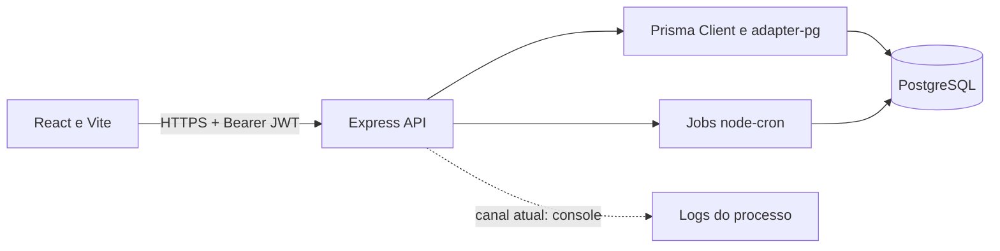

# Arquitetura

## Backend

- `src/server.ts`: carrega dotenv, configura CORS/JSON, publica `/health` e
  monta rotas sob `/api`.
- `src/routes/`: aplica autenticação e autorização por recurso.
- `src/controllers/`: valida entradas com Zod, executa regras de negócio e
  acessa Prisma.
- `src/middlewares/auth.ts`: valida bearer JWT e autoriza ações ADMIN.
- `src/middlewares/errorHandler.ts`: converte erros conhecidos para respostas
  HTTP sem expor mensagens internas genéricas.
- `src/lib/prisma.ts`: mantém uma instância Prisma com adapter PostgreSQL.
- `src/jobs/`: verifica retornos preventivos no startup e diariamente.

## Frontend

O frontend é SPA client-side. React Router controla páginas protegidas;
Axios injeta o JWT guardado no `localStorage` e remove a sessão após resposta
401. A proteção visual do frontend melhora a navegação, mas a autorização
de segurança é responsabilidade da API.

## Erros e validação

Os controllers validam corpos e parâmetros com Zod. Erros de validação
retornam 400; registros inexistentes retornam 404; conflitos de unicidade
retornam 409. Erros não classificados retornam 500 e são registrados no
console do processo.

## Processos e escala

O job usa `node-cron` dentro do processo HTTP. Em uma implantação com várias
réplicas, cada réplica executará o cron: use uma única instância de worker,
lock distribuído ou scheduler externo para evitar duplicidade. O código não
implementa filas ou lock distribuído.